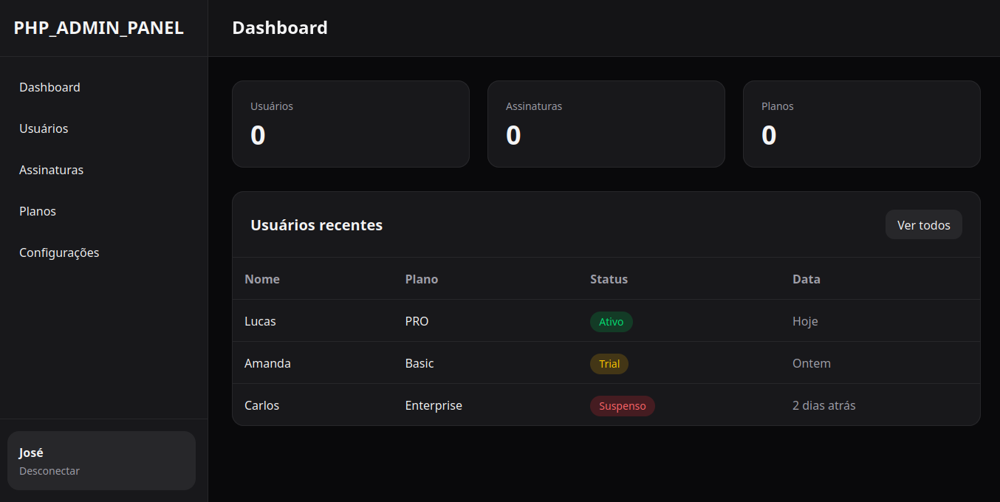

# PHP-ADMIN-PANEL

description_here



## Tecnologias
- PHP 8.4
- FlightPHP
- RotyPHP

> Aviso: Este projeto foi desenvolvimento na versão INDEV do RotyPHP, então algumas coisas não estão disponível como datetime(), unique() e etc...

## Instalação
```
git clone https://github.com/silvaleal/php-admin-panel
cd php-admin-panel
composer install
php migrations.php
php -S localhost:8000 -t public
```